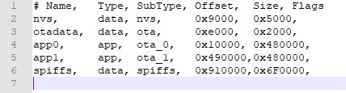
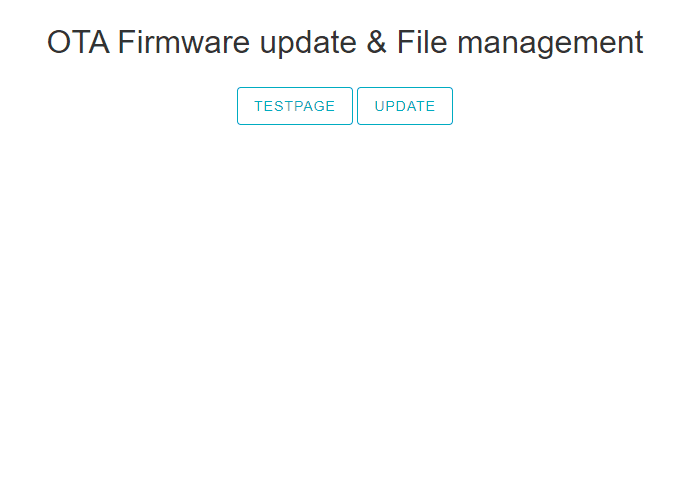
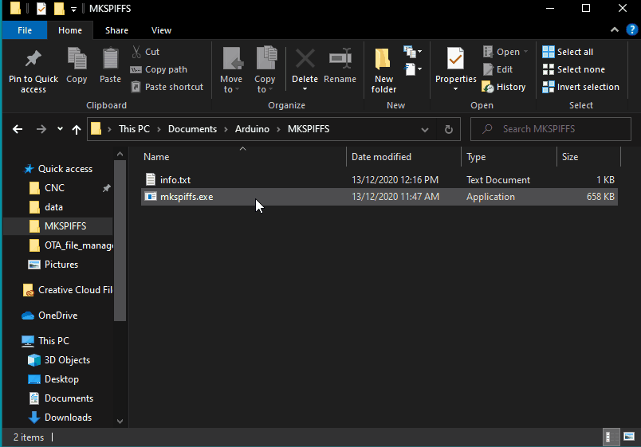
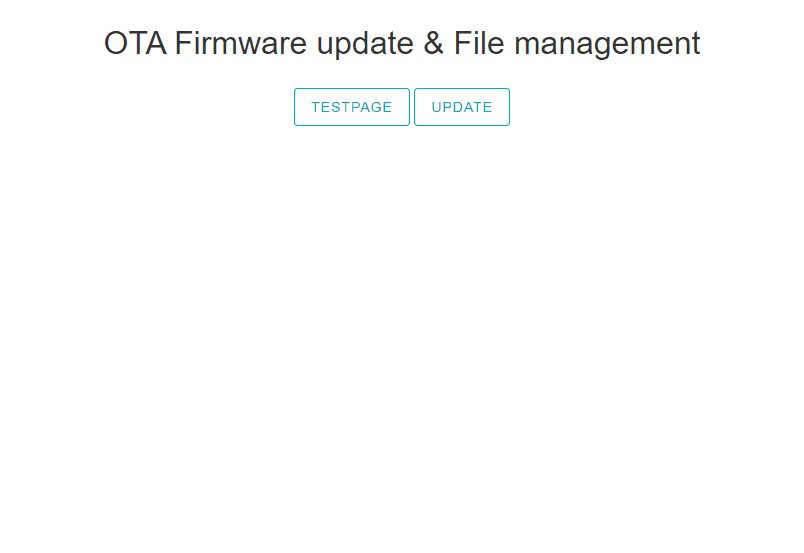

# ESP32-Async-OTA-Firmware-Update-and-File-Management
Async OTA Firmware update & File management for ESP32. 
This sketch will let you: 
1. Update ESP32 Firmware using a compiled binary file. 
2. Upload SPIFFS.bin that can contain supporting files that you might need for your project. 
3. Browse, Delete, and Upload files stored on ESP32 File system.  

<b>Make sure</b> that your partition table is ready for OTA. You can select predefined Partition tables in Arduino IDE or create your own.
  
I used 16MB chip so my partition table looks like this. 

 

<b>Don't forget</b> to include your local network SSID and PASSWORD. 
Then when everything is up and runnig you can access main page via esp32.local/ or using ip address that will be reported into a serial monitor.  

<b>1.</b> Firmware update is very straightforward. Bin file can be simply generated using Arduino IDE. Then find it, select it and press Update button. If successful there will be a popup window and after presssing OK you will be redirected to the main page. Meanwhile ESP will reboot and rewrite its APP derictory with uploaded bin. 

 

<b>2.</b> SPIFFS.bin upload. For this one I used MKSPIFFS tool to generate SPIFFS.bin file. Command that initiates compiling looks like this: 
<b>mkspiffs -c C:\Users\xxxx\Documents\Arduino\OTA_file_management\data -b 4096 -p 256 -s 0x6F0000 spiffs.bin</b> 
it compiles everything that is in data folder into one bin file. 0x6F0000 is the size of your SPIFFS partition and depends on partition table you choose. 

 

<b>3.</b> You can browse/delete/upload files stored in SPIFFS. 

 

